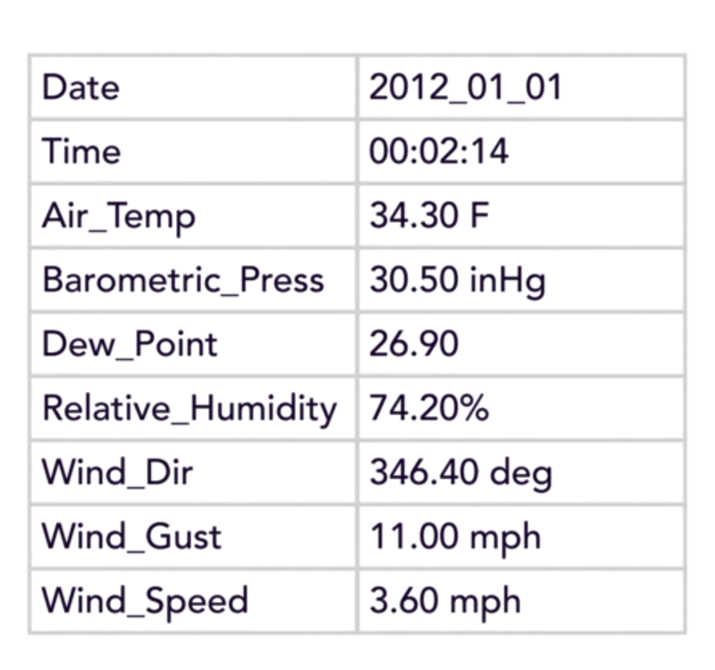
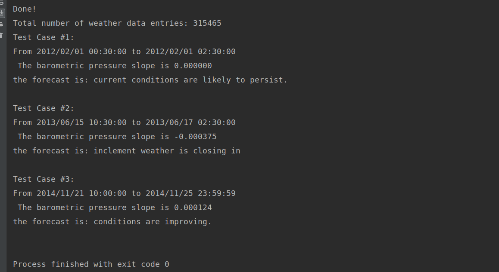

# [Code Clinic: Java](https://www.linkedin.com/learning/code-clinic-java-2)
Practice coding with Java. Code Clinic is a series of courses that solve the same problems using different programming languages. It gives developers a chance to experiment with new platforms and compare their strengths. Here, Carlos Rivas takes you through six different challenges and provides an overview of his solutions in Java. Challenges cover topics such as statistical analysis, geolocation, facial recognition, and accessing peripheral devices. Each lesson provides practical skills, valuable design patterns, and code snippets you can use in your own projects.
## Pond-Oreille
Pond Oreille is the 1st problem of Practice coding with Java.
This problem is about calculating statistics from a data set. It's easy stuff but presents a good example of how different languages accomplish common tasks.Need to calculate with weather data captured from Lake Pend Oreille in northern Idaho given by this course by <b>LinkedIn</b>. It has almost 20 mb of data from the years 2012 through 2015.

***
#### The coefficient of the slope of barometric pressure 
A rising slope indicates an increasing barometric pressure which typically means fair and sunny weather ahead. A falling slope indicates a decrease in barometric pressure which typically means stormy weather.

# Output

